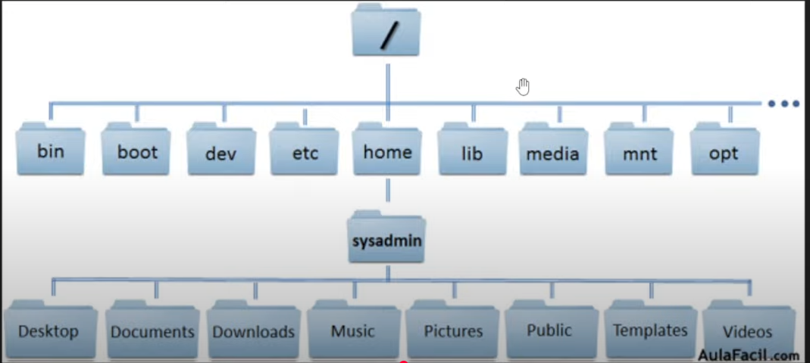

# #3_bases_linux
### Distribucion directorios en linux


### Permisos de admin (user root)
```
sudo su
```

### Limpiar terminal
```
clear
```

### Instalar algo
```
sudo apt install [app]
```

### Desinstalar algo
```
sudo apt remove [app]
```

### Remover dependencias residuales al desinstalar algo
```
sudo apt autoremove
```

### Listar archivos de un directorio
```
ls
```

### Cambiar directorio (avanzar)
```
cd [nombre_directorio]
```

### Cambiar directorio (retroceder)
```
cd ..
```

### Ver donde estamos ubicados
```
pwd
```

### Crear archivo
```
touch [nombre_archivo]
```

### Editar un fichero con NANO
```
nano [nombre_archivo] 
```

### Leer el contenido de un fichero
```
cat [nombre_archivo] 
```

### Redirigir un echo a un fichero
```
echo 'Esto es una prueba' > prueba.txt
```

### Eliminar archivo
```
rm [nombre_archivo]
```

### Crear directorio
```
mkdir [nombre_directorio]
```

### Remover directorio
```
rm-r [nombre_directorio]
```

